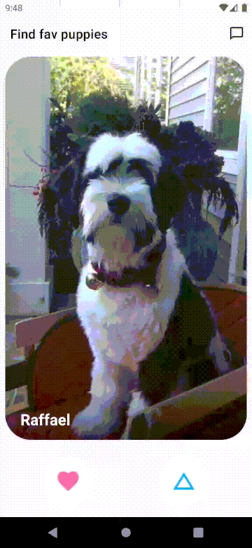

# Pupple
My first Android app created with Kotlin language for learning and improving my skills.
The app is like Tinder which is dating-app but it's for matching with dogs not people.

## Architecture
This app is based on MVVM + Repository Pattern.

It gets images of a dog from [Dog API](https://dog.ceo/dog-api/) and random names from [Random User Generator](https://randomuser.me/).  
Dogs the app got are displayed in order on the first screen and a user can fav or skip them.
Those favored by a user are registered in a local database.

## Main Libraries
- Kotlin Coroutines - simplify code that executes asynchronously
- ViewModel - storing and managing UI-related data in a lifecycle conscious way
- LiveData - observable data holder class respecting the lifecycle of other app components
- Room - providing an abstraction layer over SQLite to allow fluent database access
- Retrofit - type-safe HTTP client for Android
- Hilt - for Dependency Injection
- Glide - fast and efficient media management and image loading
